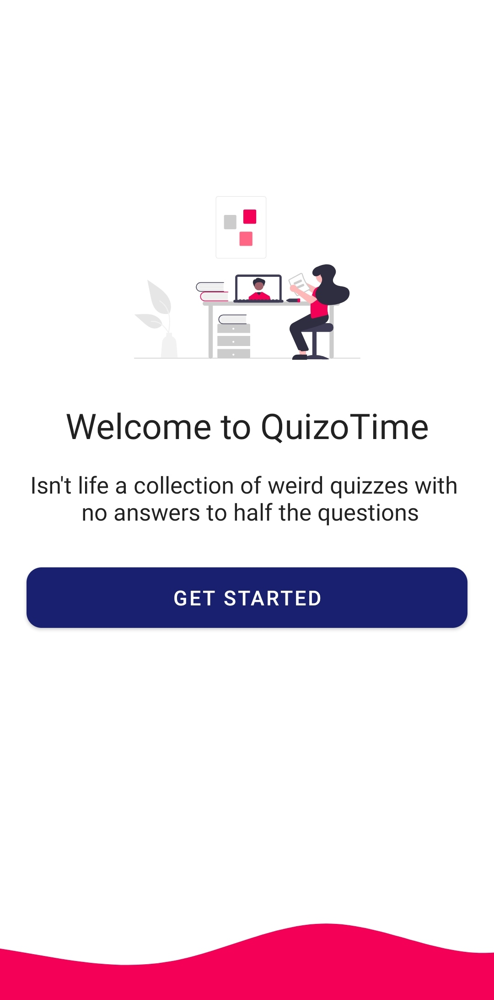
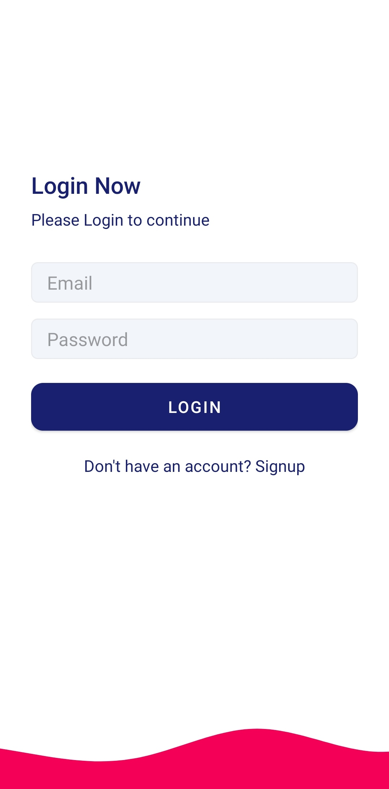
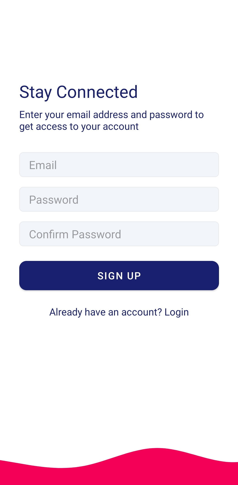
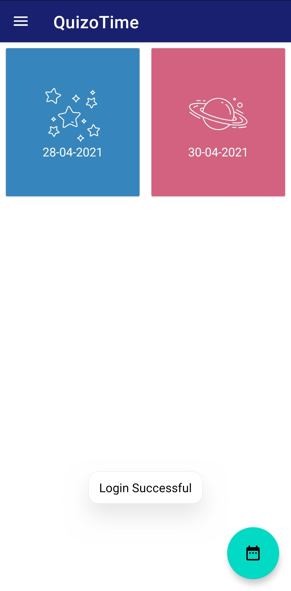
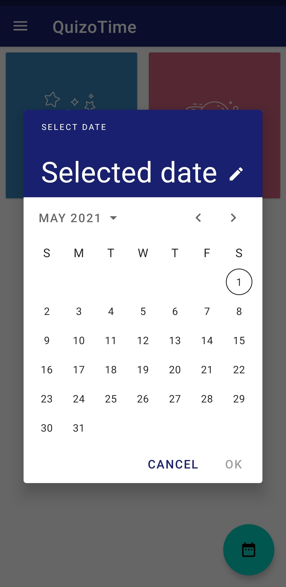
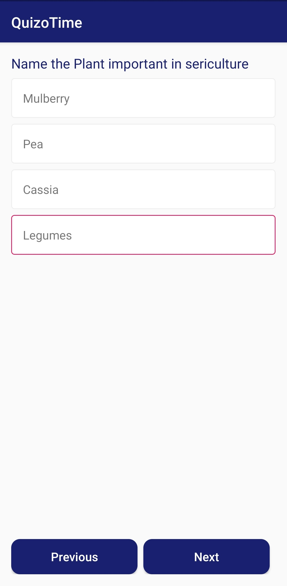
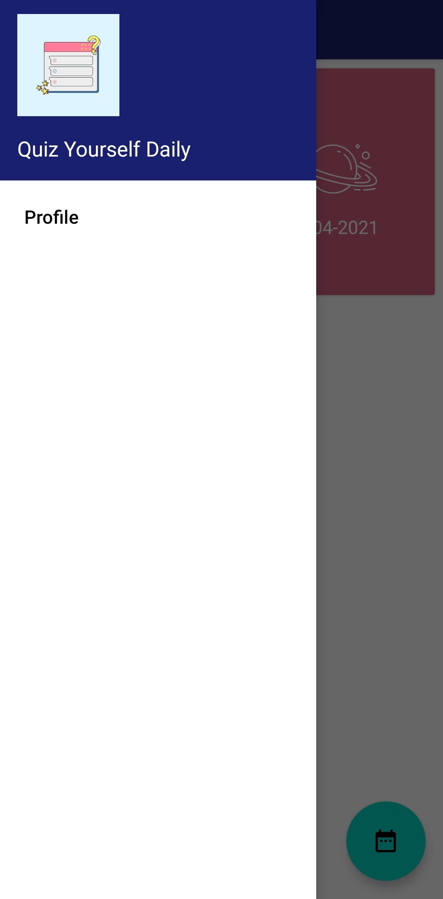

# QuizOTime

Hello Everyone 😊,
I made a Quiz Application namely "QuizOTime".It gets the quizes from Google Firestore and also has Login/Signup features.I made this application by using the following concepts:-
1. Firebase Authentication
2. Reading data from Firebase Firesore
3. Designing of Views
4. Navigation Drawer
5. Intents
6. Date Selector

Here are the glimpse of the UI of the app:-

<h4>Home Screen</h4>

  

<h4>Login Screen</h4>

  

<h4>Sigup Screen</h4>

  

<h4>All Quizzes</h4>

  

<h4>Date Selector</h4>

  

<h4>Quiz Questions</h4>

  

<h4>Result Screen</h4>

  

<h4>Navigation Drawer</h4>

  
